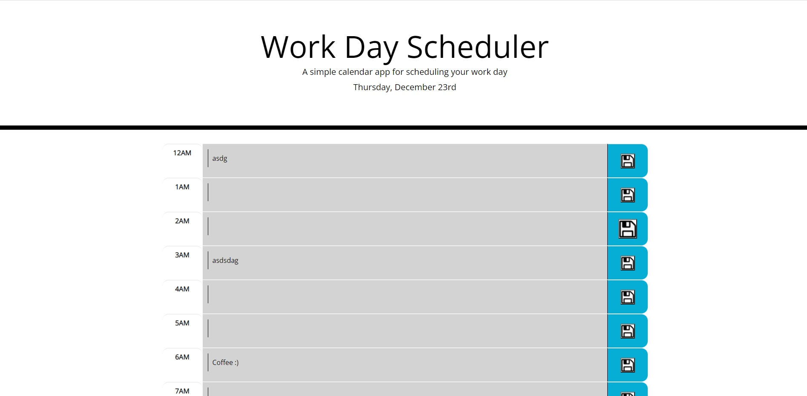

# Day_Planner_Take_2

This app is built to let you enter in tasks at hourly intervals and save them for you. Each row in the table will be highlighted a different color depending on what time of day it is.

To save a todo, first use the input field to type in your description and then hit the adjacent save button. You must hit the button adjacent to the row you typed in otherwise the entry won't save.

As of right now there is no button to clear the todos, nor do they auto wipe once a new day starts.

The deployed page can be found at:

https://karpx033.github.io/Day_Planner_Take_2/

